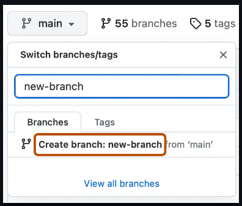
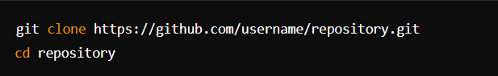
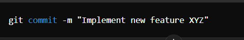
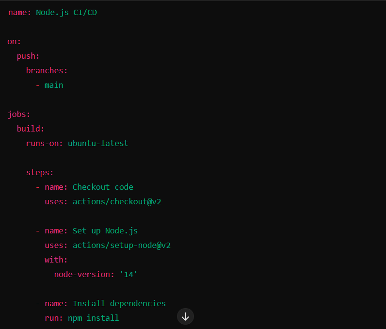
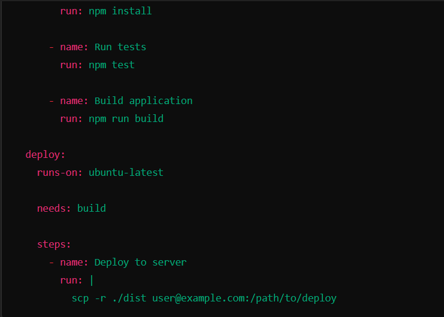

# SE-Assignment-4
Assignment: GitHub and Visual Studio
Instructions:
Answer the following questions based on your understanding of GitHub and Visual Studio. Provide detailed explanations and examples where appropriate.

Questions:
Introduction to GitHub:
1. What is GitHub, and what are its primary functions and features? Explain how it supports collaborative software development.

GitHub is a web-based Git repository hosting service, which offers all of the distributed revision control and source code management (SCM) functionality of Git as well as adding its own features.

It is a website that hosts git repositories on a remote server.
Version Control: GitHub is built around Git, a distributed version control system. It allows developers to track changes to their codebase, revert to previous versions if needed, and manage different versions of their software.

Remote Repository Hosting: GitHub provides cloud-based hosting for Git repositories. Developers can push their local Git repositories to GitHub, making it accessible to collaborators and ensuring backups of their code.

Collaboration: GitHub facilitates collaboration among developers through various features such as pull requests and issues.

Branching and Forking: GitHub supports branching, allowing developers to work on separate features or fixes without affecting the main codebase. Forking enables users to create their own copy of a repository to experiment with changes independently.

Community and Social Coding: GitHub fosters a community around open-source projects. Developers can discover projects, contribute to them, and engage with other developers through comments, discussions, and contributions.

Automation and Workflows:
Actions: GitHub Actions automate workflows such as testing, building, and deploying code directly from GitHub repositories.
CI/CD Integration: GitHub integrates with Continuous Integration (CI) and Continuous Deployment (CD) tools to automate software delivery processes.

Project Management: GitHub provides basic project management capabilities:
Projects: Organize tasks and issues into kanban-style boards to track progress.

Security: GitHub includes security features to protect repositories and code:
Access Control: Manage permissions and access to repositories.
Security Advisories: Receive alerts and recommendations for vulnerabilities in dependencies.

Integrations: GitHub integrates with various third-party services and tools, extending its functionality for project management, code review, and more.

GitHub supports collaborative software development through a variety of features and tools that facilitate communication, coordination, and code sharing among developers.These include:Remote Repository Hosting,Pull Requests (PRs),Branching and Forking, Issues and Discussion, Code Review, Project Management, Automation and CI/CD, and Community and Open Sourc.

Repositories on GitHub:
2. What is a GitHub repository? Describe how to create a new repository and the essential elements that should be included in it.

A GitHub repository, often referred to simply as a "repo," is a centralized location on GitHub where you can store and manage your code, files, and project data

Go to https://github.com/.
Sign in to your GitHub account.
In the top right corner, click the plus sign (+) and select "New repository".
Enter a name for your repository. This will be the name of the folder that your repository is stored in on GitHub.
Optionally, add a description for your repository. This will help other people understand what your repository is for.
Select whether your repository should be public or private. Public repositories can be seen by anyone on the internet. Private repositories can only be seen by people who you have invited to collaborate on the repository.
Click "Create repository".

Version Control with Git:
3. Explain the concept of version control in the context of Git. How does GitHub enhance version control for developers?

Git is a Version Control System (VCS) designed to make it easier to have multiple versions of a code base, sometimes across multiple developers or teams.It allows you to see changes you make to your code and easily revert them.

GitHub enhances version control for developers by providing:

Centralized Repository Hosting: Acts as a central hub for Git repositories, ensuring all team members have access to the latest code.

Branching and Merging: Supports Git’s branching model, enabling parallel development of features and fixes that can be merged back into the main branch.

Pull Requests (PRs): Facilitates code review and integration through PRs, where changes are proposed, reviewed, discussed, and refined before merging.

Commit History and Annotations: Visualizes commit history and allows for detailed annotations, aiding in tracking changes and providing context.

Code Reviews: Integrates code review directly into the PR workflow, ensuring changes are evaluated for quality and adherence to standards.

Conflict Resolution: Provides tools to manage and resolve conflicts that may occur during branch merging.

Example: Open Source Project Contribution

Scenario: You are a developer contributing to an open-source project hosted on GitHub. The project aims to develop a new web application framework.

1.Forking the Repository:

You start by forking the main repository of the project on GitHub to your personal GitHub account. This creates a copy of the project that you can freely experiment with without affecting the original codebase.
2.Creating a Feature Branch:

From your forked repository, you create a new branch named feature/new-component. This branch will contain the code changes for adding a new component to the framework.
3.Making Changes and Committing:

You make changes to the codebase locally on your computer, implementing the new component. As you work, you commit your changes to the local Git repository with descriptive commit messages explaining each modification.
4.Pushing Changes to GitHub:

Once the new component is implemented and tested locally, you use git push to push your feature/new-component branch to your forked repository on GitHub.
5.Creating a Pull Request (PR):

From your forked repository on GitHub, you initiate a Pull Request, proposing your changes (from feature/new-component branch) to be merged into the main repository’s main branch.
In the PR description, you provide details about the new component, the rationale behind it, and any relevant information for reviewers.
6.Code Review and Collaboration:

Other contributors and maintainers of the project review your Pull Request. They can view the diff of changes, leave comments, suggest improvements, and discuss potential adjustments directly within the GitHub interface.
Discussions and iterations happen in the PR comments section, where you and reviewers can address feedback, make necessary changes, and ensure the code meets project standards.
7.Integration and Merge:

After thorough review and any necessary revisions, your Pull Request is approved by maintainers and merged into the main repository’s main branch.
The new component is now part of the official project, benefiting from version control tracking provided by Git and GitHub.
8.Continuous Integration (CI) and Deployment:

GitHub Actions (or other CI tools integrated with GitHub) automatically trigger builds and tests upon each new Pull Request and merge to ensure that the codebase remains stable and functional.
CI pipelines can also handle deployment tasks, ensuring that new features are deployed smoothly to production environments.

Branching and Merging in GitHub:
4. What are branches in GitHub, and why are they important? Describe the process of creating a branch, making changes, and merging it back into the main branch.

Branches in GitHub are separate versions of a repository's codebase that diverge from the main branch, typically main or master.
Branches allow you to develop features, fix bugs, or safely experiment with new ideas in a contained area of your repository
Use a branch to isolate development work without affecting other branches in the repository. Each repository has one default branch, and can have multiple other branches. You can merge a branch into another branch using a pull request.

Create a Branch:
Create a new branch from the main branch (main or master) on GitHub.
This isolates your changes from the main codebase.

Make Changes Locally:
Clone the repository to your local machine if not already done.
Switch to your newly created branch locally (git checkout branch-name).
Make necessary changes to files (add, modify, delete).

Stage and Commit Changes:
Stage your changes (git add .) and commit them with a descriptive message (git commit -m "Your message").

Push Changes to GitHub:
Push your branch with changes to GitHub (git push origin branch-name).
This updates your branch on GitHub with the latest changes.

Create a Pull Request:
Navigate to GitHub and create a Pull Request from your branch.
Compare changes and propose merging your branch into the main branch.
Provide details about the changes, including a descriptive title and description.

Review and Discuss:
Collaborators review your Pull Request, provide feedback, and suggest modifications.
You can make additional commits to your branch to address feedback.

Merge Pull Request:
Once approved, merge your Pull Request into the main branch on GitHub.
Confirm the merge and resolve any merge conflicts if necessary.

Pull Requests and Code Reviews:
5. What is a pull request in GitHub, and how does it facilitate code reviews and collaboration? Outline the steps to create and review a pull request.

A pull request is a proposal to merge a set of changes from one branch into another. In a pull request, collaborators can review and discuss the proposed set of changes before they integrate the changes into the main codebase.

Creating a Pull Request:

Fork the Repository (if necessary):
If you don't have direct access to the repository, fork it to your GitHub account.

Clone the Repository:git clone https://github.com/your-username/repository.git
cd repository

Create a New Branch:
Create a new branch locally to work on your changes: git checkout -b feature-branch

Make Changes: Implement your changes (add, modify, delete files) locally.
Stage and Commit Changes:git add .    git commit -m "Add feature XYZ"

Push your branch and changes to your forked repository on GitHub: git push origin feature-branch
Lastly create Pull Request on GitHub:

Reviewing a Pull Request:
Open the Pull Request:
Navigate to the repository where the Pull Request was created.

Review Changes:
Review the summary of changes, files modified, and added commits.
Use the Files Changed tab to view the diff of changes and comments left by the contributor.

Leave Comments and Feedback:
Add comments directly on specific lines of code or within the general discussion of the Pull Request.
Suggest improvements, request clarification, or provide feedback on the proposed changes.

Discuss and Iterate:
Engage in discussions with the contributor and other reviewers to address questions, concerns, and feedback.
The contributor can make additional commits to the branch to address feedback.

Approve or Request Changes:
Once satisfied with the changes and after discussion, approve the Pull Request if you believe it's ready to merge.
If changes are needed, request specific modifications from the contributor.

Merge the Pull Request:
After approval and any necessary modifications, the repository maintainer (or contributor with permissions) can merge the Pull Request into the base branch (main or master).

GitHub Actions:
6. Explain what GitHub Actions are and how they can be used to automate workflows. Provide an example of a simple CI/CD pipeline using GitHub Actions.

GitHub Actions is a continuous integration and continuous delivery (CI/CD) platform that allows you to automate your build, test, and deployment pipeline. You can create workflows that build and test every pull request to your repository, or deploy merged pull requests to production.

1.Create a .github/workflows/main.yml file in your GitHub repository. This file defines the workflow that GitHub Actions will execute.

2.Commit and push the .github/workflows/main.yml file to your repository's main branch
3.Navigate to the "Actions" tab in your GitHub repository to monitor the progress and results of the CI/CD pipeline.

Introduction to Visual Studio:
7. What is Visual Studio, and what are its key features? How does it differ from Visual Studio Code?

Visual Studio is an integrated development environment (IDE) developed by Microsoft. It is used to develop computer programs including websites, web apps, web services and mobile apps.

Key features include a powerful code editor with IntelliSense, robust debugging tools, built-in Git support, extensive extensibility through extensions, integrated testing capabilities, cloud development integration with Azure, multi-platform support (Windows, macOS, Linux), collaboration tools like Live Share, performance profiling tools, and specialized editions for different development needs.

Key differences include:
Complexity: Visual Studio is a full-featured IDE with a comprehensive set of tools for enterprise-level development, whereas VS Code is a lightweight editor focused on simplicity and extensibility.

Target Audience: Visual Studio caters to professional developers working on large-scale projects, whereas VS Code appeals to a broader audience including individual developers, open-source contributors, and those working on smaller projects.

Integration and Extensibility: Visual Studio provides deep integration with Microsoft's development ecosystem and offers extensive extensibility through plugins and extensions. VS Code also supports a wide range of extensions but is more focused on lightweight customization.

Integrating GitHub with Visual Studio:
8. Describe the steps to integrate a GitHub repository with Visual Studio. How does this integration enhance the development workflow?

Open Visual Studio: Launch Visual Studio on your machine.

Open or Create a Project:

If you have an existing project you want to integrate with GitHub, open it.
If you're starting a new project, create it in Visual Studio.
Initialize Git Repository (if not already done):

If your project is not yet under version control, initialize a Git repository for it.
Go to File > Add to Source Control > Git.
Connect to GitHub:

Go to Team Explorer (View > Team Explorer).
Click on the "Manage Connections" button (plug icon).
Select "GitHub" and then "Connect to GitHub".
Sign in to your GitHub account if prompted.
Clone a Repository (if needed):

To work with an existing GitHub repository, clone it into Visual Studio:
In Team Explorer, click "Clone" and enter the repository URL.
Choose a local path for the repository.
Commit Changes:

Make changes to your project.
Use Team Explorer to stage changes (click "Changes" under "Team Explorer").
Enter a commit message and click "Commit All".
Push Changes to GitHub:

After committing changes, click "Sync" in Team Explorer.
Click "Push" to send committed changes to your GitHub repository.

Integrating GitHub with Visual Studio enhances development workflows by providing a unified environment for coding and Git-based version control. It streamlines collaboration through efficient repository management, automated CI/CD pipelines, and integrated code reviews. Developers benefit from powerful Git capabilities within the IDE, ensuring code integrity, faster iteration cycles, and enhanced security and compliance measures. Overall, this integration optimizes team productivity, improves code quality, and supports seamless project management from development to deployment.

Debugging in Visual Studio:
9. Explain the debugging tools available in Visual Studio. How can developers use these tools to identify and fix issues in their code?

Call Stack:

View the stack trace of currently active methods and navigate to different stack frames to understand the program's execution path.
Locals Window:

View and interact with local variables within the current scope during debugging.
Immediate Window:

Execute code and evaluate expressions interactively during debugging sessions.
Data Tips:

Hover over variables in the code editor to view their current values without breaking execution.
Debugging Toolbar:

Access commonly used debugging commands such as step into, step over, and step out, as well as run, pause, and stop debugging sessions.
Exception Settings:

Configure how Visual Studio handles exceptions, including when to break execution on specific exceptions.
Parallel Stacks and Tasks:

Debug multithreaded applications and analyze parallel tasks with dedicated tools.
IntelliTrace (Enterprise Edition):

Historical debugging tool that records events and function calls, allowing you to rewind and replay debug sessions.
.NET Core and ASP.NET Core Diagnostics:

Specific tools for debugging .NET Core and ASP.NET Core applications, including live unit testing.

These tools provide a systematic approach to troubleshooting and debugging software, providing detailed information about the program's execution, memory usage, variables, and other relevant data. By Setting Breakpoints,Inspecting Variables and Expressions,Analyzing Call Stack and Handling Exceptions

Collaborative Development using GitHub and Visual Studio:
10. Discuss how GitHub and Visual Studio can be used together to support collaborative development. Provide a real-world example of a project that benefits from this integration.

1. Meaningful Commitment Reports:
 - Clearly articulate the changes made in each commit. This helps to understand the purpose of the change.
2. Branch management:
 - Create feature branches for new development and use branches like main or master for stable production-ready code.
3. Code Review:
 - Use the code download request for code reviews. This encourages collaboration, ensures quality, and provides learning opportunities.
4. Frequent Obligations:
 - Make small, incremental commits. This helps in tracking progress and isolating problems.
5. Download Request Label:
 - Provide context, respond to feedback, and follow project guidelines when submitting pull requests.

One real-world example of a project that benefits significantly from the integration of GitHub and Visual Studio is a web application development team working on an e-commerce platform.

Scenario:
Imagine a team of developers tasked with building and maintaining an e-commerce website with features such as product listings, shopping cart functionality, user accounts, and payment processing.

By leveraging the integration of GitHub and Visual Studio, this e-commerce development team enhances collaboration, accelerates development cycles, ensures code quality, and maintains transparency across the project. The seamless integration of version control, automated pipelines, real-time collaboration tools, and robust project management capabilities allows the team to deliver a reliable and scalable e-commerce platform efficiently. This integration not only improves team productivity but also supports continuous improvement and innovation in software development practices.

References:
https://www.linkedin.com/pulse/git-github-support-collaborative-development-dhruv-soni-zbjmf/
https://code.visualstudio.com/docs/sourcecontrol/github
https://en.wikipedia.org/wiki/Visual_Studio
https://docs.github.com/en/actions/learn-github-actions/understanding-github-actions
https://chatgpt.com/
PLP Academy study modules

Submission Guidelines:
Your answers should be well-structured, concise, and to the point.
Provide real-world examples or case studies wherever possible.
Cite any references or sources you use in your answers.
Submit your completed assignment by [due date].
